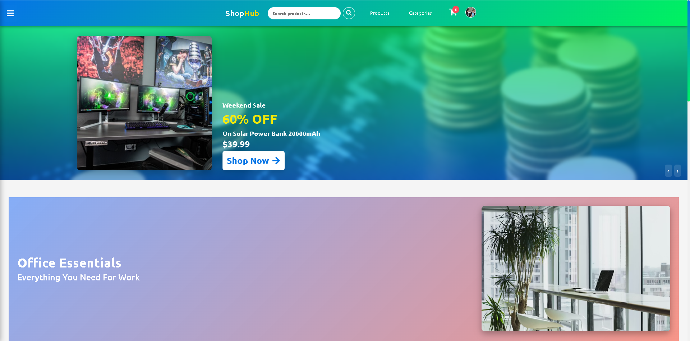
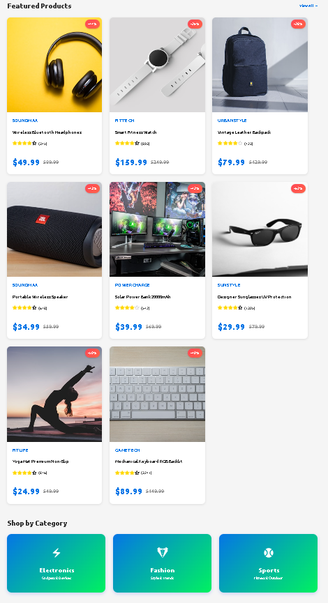
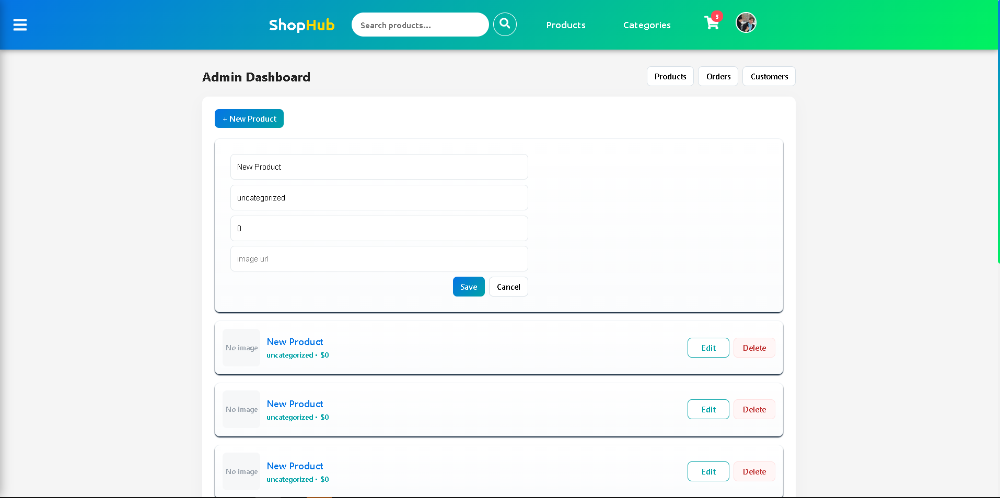

# ShopHub E-Commerce App


## Screenshots

Home Page:


Product List:


Admin Dashboard:


# ShopHub - E-Commerce Web Application

A fully responsive, modern e-commerce web application built with React.js and pure CSS. This is a 100% frontend application with simulated data - no backend required!

## Features

### 🛍️ Core Functionality

- **Product Browsing**: Browse products by category or search
- **Product Details**: View detailed product information with image gallery
- **Shopping Cart**: Add/remove items, update quantities
- **User Authentication**: Login and Signup with frontend validation
- **Payment Simulation**: Complete checkout flow with form validation
- **User Profile**: Manage account details and view order history
- **Responsive Design**: Beautiful layouts for mobile, tablet, and desktop

### 🎨 Design & UX

- **Modern UI**: Colorful, gradient-based design inspired by AliExpress
- **Smooth Animations**: Hover effects, transitions, and animations
- **Interactive Components**: Star ratings, modals, cart sidebar
- **Hero Banners**: Rotating promotional carousel
- **Category Filters**: Easy product filtering and sorting
- **Live Search**: Filter products as you type

### 📱 Responsive Breakpoints

- **Mobile**: Optimized for 320px - 640px
- **Tablet**: Optimized for 640px - 968px
- **Desktop**: Optimized for 968px and above

## Tech Stack

- **React 19**: Latest React with functional components and hooks
- **React Router v6**: Client-side routing
- **Vite**: Fast development build tool
- **Pure CSS**: No frameworks, fully custom styles
- **Context API**: State management for cart and auth
- **LocalStorage**: Persistent cart and user data

## Project Structure

```
ecommerce-app/
├── src/
│   ├── components/       # Reusable UI components
│   │   ├── Navbar.jsx
│   │   ├── Footer.jsx
│   │   ├── ProductCard.jsx
│   │   ├── Cart.jsx
│   │   ├── Modal.jsx
│   │   ├── Rating.jsx
│   │   └── *.css files
│   ├── pages/            # Page components
│   │   ├── HomePage.jsx
│   │   ├── LoginPage.jsx
│   │   ├── SignupPage.jsx
│   │   ├── ProductListPage.jsx
│   │   ├── ProductDetailsPage.jsx
│   │   ├── PaymentPage.jsx
│   │   ├── ProfilePage.jsx
│   │   └── *.css files
│   ├── context/          # React Context providers
│   │   ├── AuthContext.jsx
│   │   └── CartContext.jsx
│   ├── data/             # Mock data
│   │   ├── products.js
│   │   ├── banners.js
│   │   └── reviews.js
│   ├── App.jsx           # Main app component
│   ├── main.jsx          # Entry point
│   └── index.css         # Global styles
├── public/               # Static assets
├── index.html
├── package.json
└── vite.config.js
```

## Installation & Setup

1. **Install dependencies**:

```bash
npm install
```

2. **Start development server**:

```bash
npm run dev
```

3. **Build for production**:

```bash
npm run build
```

4. **Preview production build**:

```bash
npm run preview
```

## Usage Guide

### Demo Credentials

- **Login**: Use any email and password (minimum 6 characters)
- **No real authentication** - all data is simulated

### Pages

#### 🏠 Home Page (`/`)

- Hero banner with call-to-action
- Rotating promotional carousels
- Featured products grid
- Category shortcuts

#### 📦 Products Page (`/products`)

- View all products
- Filter by category
- Sort by price, rating, newest
- Live search functionality

#### 🔍 Product Details (`/products/:id`)

- Image gallery with thumbnails
- Product information and description
- Customer reviews
- Quantity selector
- Add to cart

#### 🛒 Cart

- Click cart icon in navbar to open
- View selected items
- Update quantities
- Remove items
- Proceed to checkout

#### 💳 Payment Page (`/payment`)

- Order summary
- Payment form with validation
- Success screen
- Automatic redirect to profile

#### 👤 Profile Page (`/profile`)

- View and edit account details
- Order history
- Logout option

#### 🔐 Login/Signup (`/login`, `/signup`)

- Frontend form validation
- Auto-generate user avatar
- Persist login state

## Key Features Explained

### Cart Management

- Cart persists in localStorage
- Real-time cart badge count
- Sidebar cart with smooth animations
- Empty cart handling

### Authentication

- Simulated login/signup
- Protected routes for payment and profile
- Auto-redirect to login when needed
- User avatar generation

### Product Filtering

- Category-based filtering
- Price sorting (low to high, high to low)
- Rating-based sorting
- Search term filtering
- URL-based filter state

### Responsive Design

- Mobile-first approach
- Flexible grid layouts
- Touch-friendly interactions
- Optimized images and assets

## Customization

### Colors

The app uses a gradient-based color scheme. Main colors:

- Primary: `#667eea` (Purple)
- Secondary: `#764ba2` (Deep Purple)
- Accent: `#ffd700` (Gold)
- Success: `#2ed573` (Green)
- Danger: `#ff4757` (Red)

### Add Products

Edit `src/data/products.js` to add/remove products:

```javascript
{
  id: 13,
  name: "Your Product",
  price: 99.99,
  // ... other fields
}
```

### Modify Categories

Edit categories in `src/data/products.js`:

````javascript
export const categories = [
  ## ShopHub E-Commerce App

  A modern, responsive e-commerce demo built with React and Vite. This app showcases a full-featured online shop experience, including product browsing, cart, checkout, authentication, admin dashboard, and more—all client-side with localStorage persistence.

  ## Features

  - **Home Page**: Hero section, promo/deals slider, responsive banners
  - **Product Listing**: Category filters, accessible dropdown, grid layout
  - **Product Details**: Ratings, images, description
  - **Cart**: Add/remove products, quantity management
  - **Checkout**: Payment simulation, order persistence
  - **Authentication**: Signup/login with validation (name, email, strong password)
  - **Cookie Consent**: Modal banner blocks interaction until accepted/rejected
  - **Admin Dashboard**:
    - Products: Add/edit/delete, grid view, localStorage persistence
    - Orders: View orders created via checkout
    - Customers: View customer snapshots
  - **Sidebar Navigation**: Links to all main pages, admin link (future: protect for admins)
  - **Responsive Design**: Mobile-first, grid adapts to screen size
  - **Accessibility**: Keyboard navigation, ARIA roles, focus management

  ## Tech Stack

  - **Frontend**: React, Vite
  - **Styling**: CSS (modular per page/component)
  - **Persistence**: localStorage (products, cart, orders, customers)
  - **No backend**: All data is client-side for demo purposes

  ## Getting Started

  ### Prerequisites
  - Node.js (v16+ recommended)
  - npm (comes with Node.js)

  ### Installation
  ```bash
  npm install
````

### Running the App

```bash
npm run dev
```

- Open [http://localhost:5173](http://localhost:5173) in your browser

### Building for Production

```bash
npm run build
```

- Output in `dist/` folder

### Preview Production Build

```bash
npm run preview
```

## Project Structure

```
public/
  vite.svg           # Shop icon SVG (replaces Vite logo)
src/
  App.jsx            # Main app component
  App.css            # Global styles
  index.css          # Base CSS
  main.jsx           # Entry point
  assets/            # Images, icons
  components/        # Reusable UI components (Cart, Footer, Modal, Navbar, ProductCard, Rating, Sidebar, CookieBanner)
  context/           # Auth and Cart context providers
  data/              # Seed data (products, banners, reviews)
  pages/             # Main pages (Home, ProductList, ProductDetails, Admin, Auth, etc.)
```

## Key Files & Folders

- `src/pages/AdminPage.jsx` / `AdminPage.css`: Admin dashboard UI and styles
- `src/pages/ProductListPage.jsx` / `ProductListPage.css`: Product listing and filtering
- `src/pages/PaymentPage.jsx`: Checkout and order persistence
- `src/components/Sidebar.jsx`: Navigation sidebar
- `src/components/CookieBanner.jsx`: Cookie consent modal
- `src/context/AuthContext.jsx`, `CartContext.jsx`: State management

## Development Notes

- **LocalStorage**: All admin/product/order/customer data is stored in browser localStorage. No server or database is used.
- **Admin Features**: Accessible via sidebar link. Products added/edited in admin appear in product list; orders created on checkout appear in admin orders.
- **Validation**: Signup/login forms enforce name, email, and strong password rules.
- **Event System**: Custom events notify product list when admin changes occur.
- **Responsive Grid**: Product cards are capped in width and centered for readability on large screens.

## Customization

- To change the shop icon, replace `public/vite.svg` with your own SVG.
- To add backend/API, replace localStorage logic with API calls in context/providers and admin pages.
- To protect admin routes, add role-based logic in `AuthContext` and conditionally render admin links/routes.

## Roadmap / TODO

See the in-repo todo list for planned features:

- Inventory & variants (SKUs, stock management)
- Promotions, coupons, gift cards
- Email delivery (order confirmation, password reset)
- Search, pagination, server-side filtering
- Shipping, multi-currency, i18n
- Accessibility audit, analytics, wishlist, reviews, recommendations
- Mobile app/PWA, CDN/image optimization, CI/CD, Docker, tests

## License

MIT (for demo purposes)

## Author

Adino Aschalew

---

For questions or contributions, open an issue or pull request on GitHub.
